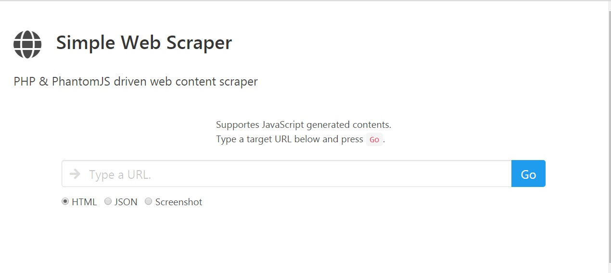

# PHP Simple Web Scraper
A PHP application for Heroku, which can dump web site outputs including JavaScript generated contents.

<p align="center">
   
</p>

## Ouput Types
- HTML
HTML source code of the target web site. JavaScript generated contents are also retrieved and dumped.

- JSON
HTTP response data as JSON. Useful for cross site communications with JSONP.

- Screenshot
A jpeg image of the site.

## Heroku Application
This is a Heroku application and meant to be deployed to [Heroku](https://dashboard.heroku.com/).

### Requirements
- Heroku account
- [Heroku CLI](https://devcenter.heroku.com/articles/heroku-command-line)
- Git

### Steps to Deploy
1. Clone this repository to your local machine. Create a directory and from there, in a console window, type the following.
```
git clone https://github.com/michaeluno/php-simple-web-scraper.git
```
This will download the repository files.

2. Change the working directory to the cloned one.
```
cd php-simple-web-scraper
```

3. Login to Heroku from Heroku CLI. 
```
heroku login
```

4. Create a new Heroku app.
```
heroku create
```
This gives somehing like this with a random app name. `glacial-basin-46381` is the app name in the below example.
```
https://glacial-basin-46381.herokuapp.com/ | https://git.heroku.com/glacial-basin-46381.git
```

5. Type the following. Replace `{heroku-app-name}` with your app name given in the above step.
```
heroku git:remote -a {heroku-app-name}
```

5. Upload the files to Heroku.
```
git push heroku master
```

5. Open the app in your browser.
```
heroku open
```